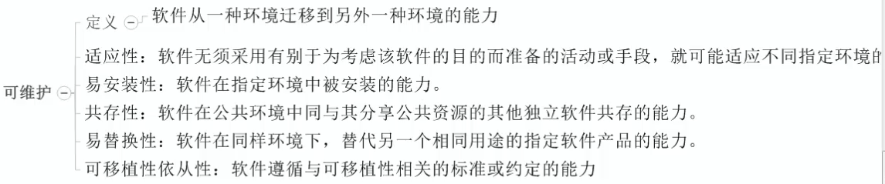
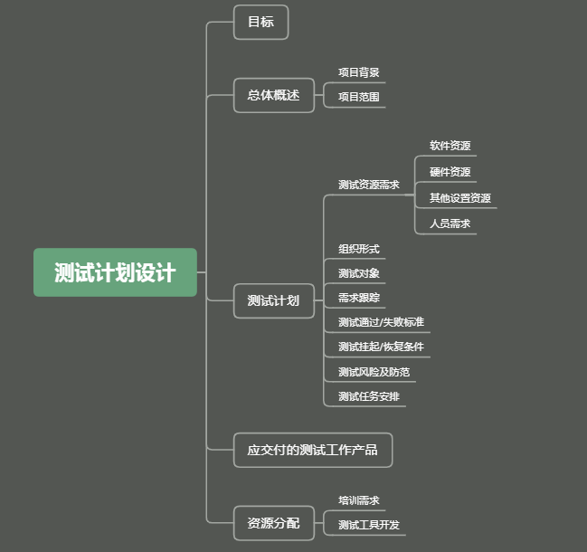
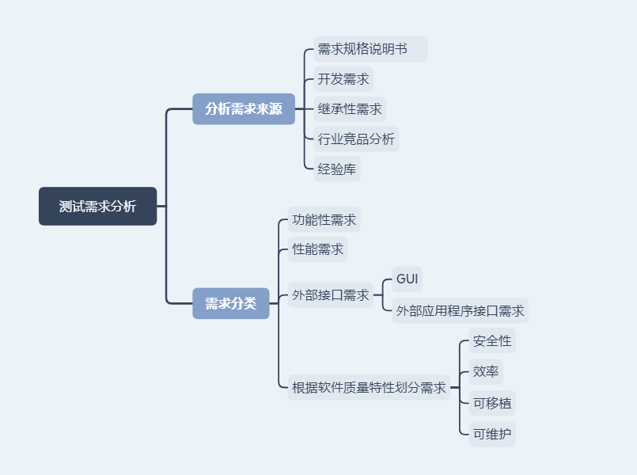

## 系统测试

### 一、软件测试基础

#### 1.测试定义

- 通过人工或者自动的手段，对被测对象进行检测的活动，目的在于发现被测对象是否实现用户的需求，或者弄清楚实际结果与预期结果之间的差异

#### 2.测试目的

- 发现被测对象与用户需求间的差异--俗称找bug
- 通过测试活动发现并解决缺陷，增加人们对被测对象的质量和信心
- 通过测试活动，获取被测对象的质量信息，为决策提供数据依据
- 通过测试活动，预防缺陷，从降低项目或产品风险

#### 3.测试原则

-  测试证明软件存在缺陷
- 不肯能执行穷尽测试
- 测试尽早启动，尽早介入
- 缺陷存在群集现象    (比如qq用户80都用聊天功能，集中资源用于测试核心功能)
- 杀虫剂悖论    (测试用例第一次发现问题后，被修复后再次用此用例有可能无法测试出，所以要跟进经验变化测试用例)
- 不同的测试活动依赖不同的测试背景
- 不存在缺陷的谬论(一个产品没有用户，就是没有bug也是无用的)

#### 4.测试对象

- 软件源代码
- 与软件源代码匹配的文档
- 支撑软件源代码运行的配置数据
- 需求阶段-需求文档-测试需求文档是否正确实现了用户的需求
- 系统设计阶段
  1. 概要设计文档
  2. 详细设计文档
  3. 是否有设计或逻辑上的错误
- 编码阶段-测试源代码-发现编码上的错误
- 系统测试阶段-被测对象是否满足用户需求

#### 5.测试级别

##### 5.1单元测试

- 针对被测系统最小的组成单元实施的测试活动，一般是类函数，也可能是最小的功能单元

##### 5.2集成测试

- 针对组件/单元与组件/单元之间的接口实施的测试活动，验证接口设计是否与设计相符
- 分3种集成
  1. 函数间集成
  2. 模块间集成
  3. 子系统间测试

##### 5.3系统测试 *

- 将通过集成测试的软件，部署在真实的用户环境下执行测试

###### 5.3.1系统测试类型

- 功能性测试

  1. 在指定使用条件下，使用被测对象，验证其是否满足用户显性或隐性需求
  2. 测试关注点
     - 是否有不正确或遗漏或多于的功能
     - 满足系统显性或隐性需求
     - 是否对输入输出做出了正确的响应，输出结果能否正确的显示

- 性能测试

  1. 通过模拟被测对象运行业务压力或使用场景，验证被测对象是否满足预先设定的性能指标
  2. 验证系统是否具有宣传的能力
  3. 了解测试系统典型场景，并具有确定的性能目标
  4. 要求在真实环境下实施

  (备注：主要专门工具测试)

- 安全性测试

  1. 测试被测对象的安全保护机制保护系统不受非法侵入，能够接受正确授权的操作

- 兼容性测试

  1. 验证被测对象在不用的操作系统、硬件信息等环境下的运行情况

##### 5.4验收测试

- 以用户为主的测试，验收组应该由项目组成员、用户代表组成

- α测试

  1. 由用户在开发环境下执行的测试活动，开发者在测试人员身边，发现问题及时沟通解决

- β测试

  1. 开发者不在测试人员身边，发现问题由专人统一收集，再由研发人员进行修改

- UAT测试

  1. 用户接受度测试，一般商业用户验证系统可用性进行的测试

#### 6.软件测试方法

- 黑盒测试
  1. 不关注被测对象内部结构，仅从用户需求考虑，是否满足用户显性或隐性需求
- 白盒测试
  1. 结构测试、逻辑驱动测试
- 灰盒测试
  1. 即关注被测对象的外部特性，又关注其内部设计
- 静态测试
  1. 不执行被测对象的程序，不允许被测对象    的测试方法
- 动态测试
  1. 执行被测对象，进行的检测活动
- 手动测试
  1. 通过测试工程师试用、验证被测对象是否满足用户需求
- 自动化测试
  1. 通过自动化测试工具，或脚本语言自动化完成测试过程

#### 7.软件质量

- 质量定义
  1. 软件产品满足用户或规定显性或隐性需求的程度
  2. 内部质量
  3. 过程质量
  4. 外部质量
  5. 使用质量
- 质量特性
  1. 功能性
     - 定义：软件在指定条件下使用时，满足用户明确和隐含需求的功能的能力
     - 适合性：软件为指定的任务和用户目标提供一组合适功能的能力
     - 准确性：软件提供具有所需精确度的正确或相符的结果或效果的能力
     - 互操作性：软件与一个或更多的规定系统进行交互的能力
     - 保密安全性：软件保护信息和数据能力，以使未授权的人员或系统不能阅读或修改这些信息和数据，而不拒绝授权人员或系统对它们的访问
     - 功能性依从性：软件遵循与功能性相关的标准、约定或法规以及类似规定的能力。这些标准要考虑国际标准、国家标准、行业标准、企业内部规范等
     
  2. 可靠性
     - 定义：软件在指定条件下使用时，维护规定的性能级别的能力
     - 成熟性：软件为避免由软件中错误导致失效的能力
     - 容错性：在软件出现故障或者违反指定接口的情况下，软件维护规定的性能级别的能力。
     - 易恢复性：在失效发生的情况下，软件重建规定的性能级别并恢复受直接影响的数据的能力
     - 可靠性依从性：软件遵循与可靠性相关的标准、约定或法规的能力
     
  3. 易用性
     - 定义：在指定条件下使用时，软件被理解、学习、使用和吸引用户的能力
     - 易学性：软件使用户能学习其应用的能力
     - 易操作性：软件使用户能操作和控制它的能力
     - 吸引性：软件吸引用户的能力
     - 易用性依从性：软件遵循与易用性相关的标准、约定、风格指南或法规的能力。这些标准要考虑国际标准
     
  4. 效率
  
     - 定义：在规定条件下，相对所有资源的数量，软件可提供适当性能的能力
     - 时间特性：在规定条件下，软件执行其功能时，提供适当的响应和处理时间以及吞吐率的能力，即完成。。。。。。。。。。
     - 资源利用性：在规定条件下，软件执行其功能时，使用合适的资源数量和类别的能力
     - 效率依从性：软件遵循与效率相关的标准或约定的能力
  
  5. 可移植
  
     
  
 
  
  6. 可移植
  
     
  
 

提出缺陷有足够的理论基础，程序员不认可，要看引发的后果

### 二、系统测试流程

1.系统测试流程主要构成：计划、设计、实现、执行四个阶段；也可以分为：测试计划设计、测试需求分析、测试策略设计、测试规程设计、测试用例设计、配置测试环境、执行测试用例、缺陷跟踪回归、测试报告输出、测试结束活动。

#### 1.测试计划设计

  
 

软件资源包括：
操作系统资源（Windows、Linux、Unix、MAC）、
数据库（SQL Server、Mysql、Oracle、Sybase、DB2）、
Web服务器（IIS、Tomcat、JBOSS、RESIN、Weblogic、Websphere）和需加版本号。

硬件资源包括：硬件服务器、手机、平板和测试设备。

***\*注意\****：测试计划设计主要用于管理的统筹，是由测试经理和主管来定义，普通测试工程师不参与测试计划的制定和编写，故在***\*简历\****中不写。

#### 2.测试需求分析

  
 

